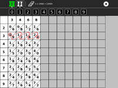

Napier activity 
===============

Napier's Bones are a simple multiplication calculator invented by John Napier in the 16th century.

How to use?
===============

Napier activity is not a part of Sugar Desktop but can be added. Refer to the following links-

* [How to Get Sugar on sugarlabs.org](https://sugarlabs.org/), 
* [How to use Sugar](https://help.sugarlabs.org/), and;
* [How to download Napier](https://activities.sugarlabs.org/en-US/sugar/addon/4429) 

How to upgrade?
===============
On Sugar Desktop systems;

* [Use My Settings,](https://help.sugarlabs.org/my_settings.html) [Software Update](https://help.sugarlabs.org/my_settings.html#software-update) 
* [Use Browse to open ](https://activities.sugarlabs.org/)activities.sugarlabs.org Search for Napier, then download.
